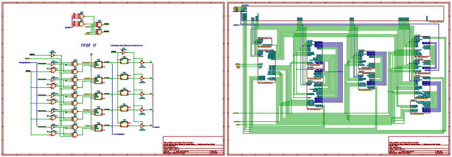
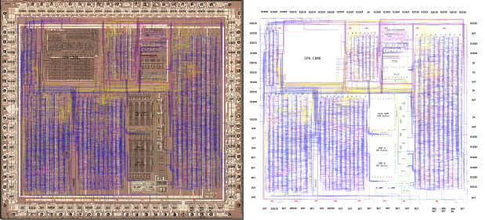
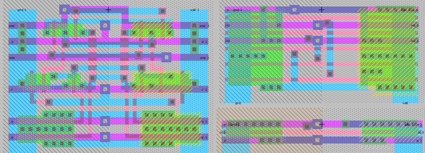

Game Boy DMG CPU Schematics
===========================

Contains reverse engineered schematics of the Game Boy DMG-CPU B chip.

The schematics in this repository are derived from the schematics in
[furrtek/DMG-CPU-Inside](https://github.com/furrtek/DMG-CPU-Inside) (CC-BY-SA 4.0 Furrtek).

PDF Export
----------

Most recent PDF export can be found
[here](http://iceboy.a-singer.de/doc/dmg_cpu_b_sch.pdf), or in the
[release](https://github.com/msinger/dmg-schematics/releases) section on github.

Files in this repo
------------------

| File(s)                                      | Description                                                                       |
| -------------------------------------------- | --------------------------------------------------------------------------------- |
| ./dmg\_cpu\_b/dmg\_cpu\_b.kicad\_pro         | KiCad project file for the schematics of the chip.                                |
| ./dmg\_cpu\_b/\*.kicad\_sch                  | KiCad schematic sheets.                                                           |
| ./dmg\_cpu\_b/lib/DMG\_CPU\_Cells.kicad\_sym | KiCad library with symbols for all the logic cells in the chip.                   |
| ./dmg\_cpu\_b/overlay/dmg-cpu-b\_overlay.svg | Modified version of Furrtek's overlay for the chip's die shot.                    |
| ./dmg\_cells/dmg-cpu.jelib                   | Electric VLSI cell library containing layouts of the cells used in the chip.      |
| ./netlist/\*.nl                              | Text files containing all cells and wires, and their connections and coordinates. |

Overlay SVG
-----------

The overlay SVG image contains the contours of the cells in the die shot and highlights all the wires
connecting the cells. Also the cells are labeled with the same names they have in the schematics.

We took the overlay from Furrtek and modified it to keep it in sync with the fixed schematics.

To open the overlay with a SVG viewer/editor (like Inkscape) you need to download the die shots and place
them into the same directory where the overlay file is.
The die shots can be downloaded from
[here](https://siliconpr0n.org/map/nintendo/dmg-cpu-b/single/nintendo_dmg-cpu-b_mz_mit20x.jpg) and
[here](https://siliconpr0n.org/map/nintendo/dmg-cpu-b/single/nintendo_dmg-cpu-b_s1-1_mit20x.jpg).

Electric VLSI Library
---------------------

The [Electric VLSI](https://www.staticfreesoft.com/) library contains layouts and schematics for the standard cells used
in the chip.

Screenshots of these layouts can be seen in the cell reference documentation
[here](http://iceboy.a-singer.de/doc/dmg_cells.html).

Netlist
-------

The files in the netlist folder contain definitions for all cells and wires of the chip.
They can be parsed by the [nlconv](https://github.com/msinger/nlconv) tool. This tool is
currently capable of converting the netlists into the following products:
 * HTML file with colors and links that make the netlists more readable.
 * PNG images that are used for the overlays on the Leaflet [map](http://iceboy.a-singer.de/dmg_cpu_b_map/) of the
   chip.
 * Java Script code that is used by the same Leaflet map for allowing the user to click on and select cells and wires,
   to get more information about them.

It is planned to add the functionality to generate HDL code for simulation from the same files.
