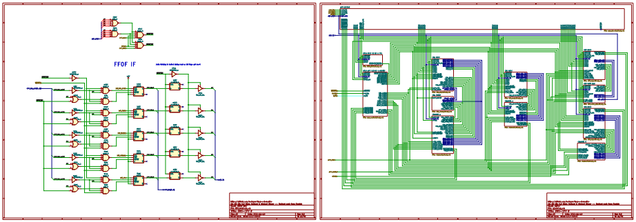
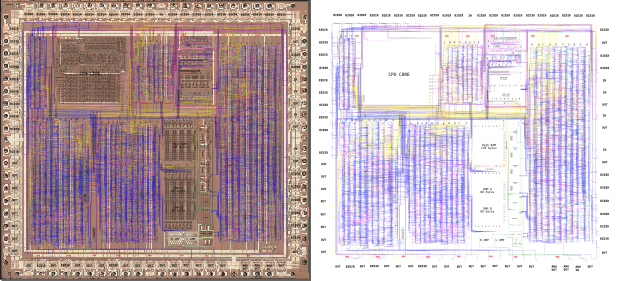
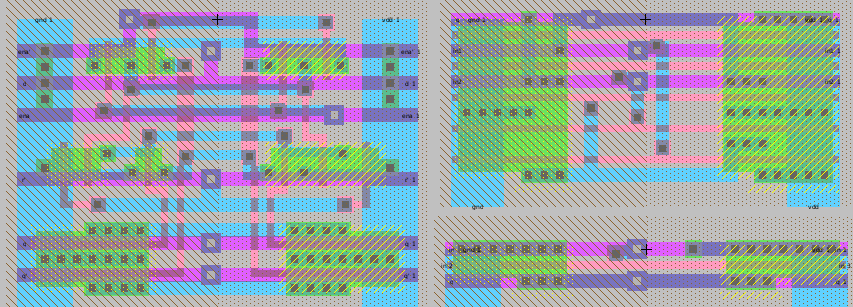
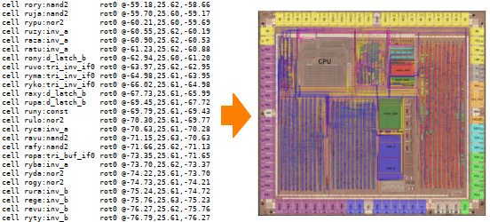

Game Boy DMG-CPU Schematics
===========================

Contains reverse engineered schematics of the Game Boy DMG-CPU B chip, including the SM83 CPU core, as well as
VLSI layouts and parsable netlists.

Originally, the DMG-CPU B schematics in this repository were derived from the schematics in
[furrtek/DMG-CPU-Inside](https://github.com/furrtek/DMG-CPU-Inside) (CC-BY-SA 4.0 Furrtek). They contain a lot of fixes
that were never applied to DMG-CPU-Inside.

PDF Export
----------

Most recent PDF exports can be found in the
[release](https://github.com/msinger/dmg-schematics/releases) section on github.

Files in this repo
------------------

| File(s)                                      | Description                                                                           |
| -------------------------------------------- | ------------------------------------------------------------------------------------- |
| ./dmg\_cpu\_b/\*                             | KiCad project with schematics of the DMG-CPU B chip.                                  |
| ./sm83/\*                                    | KiCad project with schematics of the SM83 CPU core.                                   |
| ./dmg\_cpu\_b/overlay/dmg-cpu-b\_overlay.svg | Modified version of Furrtek's overlay for the chip's die shot.                        |
| ./dmg\_cells/dmg-cpu.jelib                   | Electric VLSI cell library containing layouts of the standard cells used in the chip. |
| ./sm83\_cells/sm83.jelib                     | Electric VLSI cell library containing the layout of the complete SM83 CPU core.       |
| ./netlist/\*                                 | Text files containing all cells and wires, and their connections and coordinates.     |

Overlay SVG
-----------

The overlay SVG image contains the contours of the cells in the die shot and highlights all the wires
connecting the cells. Also, the cells are labeled with the same names they have in the schematics.

We took the overlay from Furrtek and modified it to keep it in sync with the fixed schematics.

To open the overlay with an SVG viewer/editor (like Inkscape) you need to download the die shots and place
them into the same directory where the overlay file is.
The die shots (`nintendo_dmg-cpu-b_mcmaster_mz_mit20x.jpg` and `nintendo_dmg-cpu-b_mcmaster_s1-1_mit20x.jpg`)
can be downloaded from [here](https://siliconpr0n.org/map/nintendo/dmg-cpu-b/single/).

Electric VLSI Library
---------------------

The [Electric VLSI](https://www.staticfreesoft.com/) libraries contain layouts for the standard cells used
in the chip as well as the complete SM83 CPU core.

Screenshots of these layouts can be seen in the cell reference documentations:
[dmg\_cells](http://iceboy.a-singer.de/doc/dmg_cells.html),
[sm83\_cells](http://iceboy.a-singer.de/doc/sm83_cells.html)

Netlist
-------

The files in the netlist folder contain definitions for all cells and wires of the chip.
They can be parsed by the [nlconv](https://github.com/msinger/nlconv/) tool. This tool is
currently capable of converting the netlists into the following products:
 * HTML file with colors and links that make the netlists more readable.
 * PNG images that are used for the overlays on the Leaflet maps of the chip:
   [dmg\_cpu\_b\_map](http://iceboy.a-singer.de/dmg_cpu_b_map/) and
   [sm83\_map](http://iceboy.a-singer.de/sm83_map/).
 * JavaScript code that is used by the same Leaflet maps for allowing the user to click on and select cells and wires,
   to get more information about them.
 * SystemVerilog code for simulating the chip: [dmg-sim](https://github.com/msinger/dmg-sim/)

